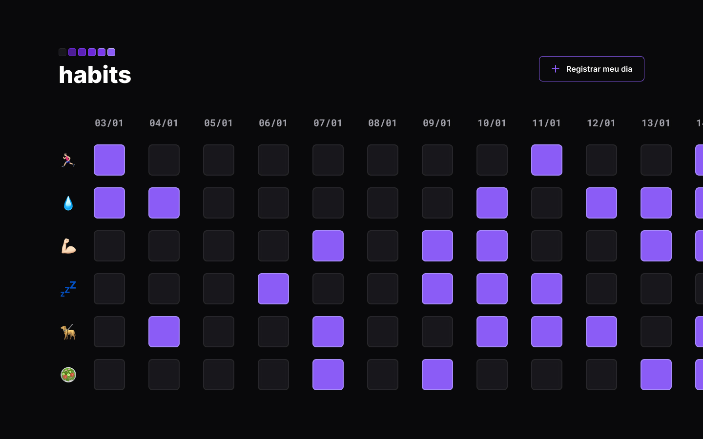

<!-- # HABITS TRACKER

App para usar como assistente de controle de hábitos estudando fundamentos da programação

<strong>=> LINGUAGENS UTILIZADAS</strong>

  
  
  

<strong>=> LINK REPOSITÓRIO</strong>  
   -->

<h1 align="center"> Habits </h1>

NLW é um evento exclusivo e gratuito, promovido pela Rocketseat para ensino de tecnologias WEB.  

  

 

  

## 🚀 Tecnologias

Esse projeto foi desenvolvido com as seguintes tecnologias:

## 💻 Projeto

O Habits é um app para ajudar a rastrear os hábitos.

- [Visite o projeto online](https://github.com/MarcosLenilson/HABITS)

## 🔖 Layout

Você pode visualizar o layout do projeto através [DESSE LINK](https://www.figma.com/community/file/1195327109778210238). É necessário ter conta no [Figma](https://figma.com) para acessá-lo.
